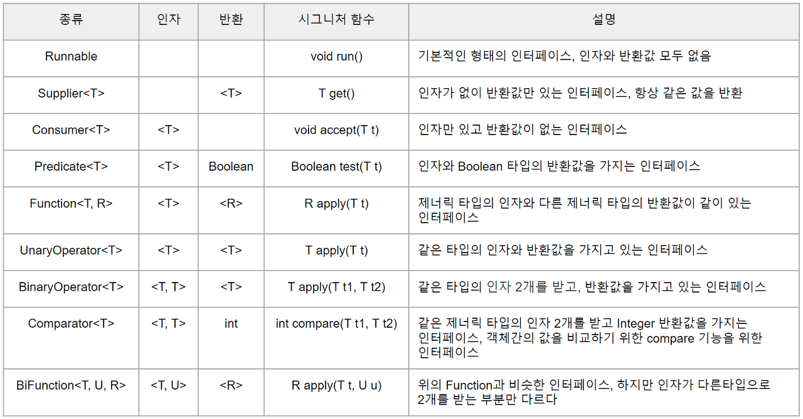

# 람다식
- 람다식은 메서드를 하나의 식으로 표현한 것으로, 람다식으로 메서드의 역할을 대신할 수 있다.
- 또한 람다식은 메서드의 매개변수로 전달되거나, 메서드의 결과로 반환될 수도 있어 메서드를 변수처럼 다루는 것이 가능하다.

<br>

### 람다식 작성 규칙
- 메서드에서 이름과 반환타입을 제거하고 매개변수 선언부와 몸통 {} 사이에 -> 를 추가한다.
- 반환값이 있는 메서드의 경우, return 문 대신 식으로 대신할 수 있다.
- 람다식에 선언된 매개변수의 타입은 추론이 가능한 경우 생략 가능하다.
- 선언된 매개변수가 하나뿐인 경우에는 괄호 ()를 생략할 수 있지만, 매개변수의 타입이 있으면 생략할 수 없다.
- 괄호 {} 안의 문장이 하나일 때는 괄호 {}를 생략할 수 있지만, return 문일 경우 생략할 수 없다.
- 람다식 내에서 참조하는 지역변수는 final이 붙지 않았어도 상수로 간주된다.

<br>

## 함수형 인터페이스
- 람다식을 다루기 위한 인터페이스
- 람다식과 인터페이스의 메서드가 1:1로 연결되어야 하므로, 함수형 인터페이스에는 오직 하나의 추상 메서드만 정의되어 있어야 한다.
- But, static 메서드와 default 메서드의 개수에는 제약이 없다.
- java.util.function 패키지에 자주 쓰이는 형식의 메서드를 함수형 인터페이스로 정의해 놓았다.

<br>



<br>

### 람다식의 타입과 형변환
- 함수형 인터페이스로 람다식을 참조할 수 있는 것일 뿐, 람다식의 타입과 함수형 인터페이스의 타입이 일치하는 것은 아니다.
  - 람다식은 익명 객체이고, 익명 객체는 컴파일러가 임의로 이름을 정하기 때문에 타입을 알 수 없다.
- 따라서, 대입 연산자의 양변의 타입을 일치시키기 위해 형변환이 필요하다.
- 람다식이 함수형 인터페이스를 구현한 클래스의 객체와 동일한 경우, 형변환은 생략 가능하다.
  - But, Object 타입으로 형변환은 불가능하고 오직 함수형 인터페이스로만 형변환 가능하다.

<br>

## 메서드 참조
- 람다식이 하나의 메서드만 호출하는 경우, 메서드 참조라는 방법으로 람다식을 간단히 처리할 수 있다.
- 이미 생성된 객체의 메서드를 람다식에서 사용한 경우에는 클래스 이름 대신 그 객체의 참조변수를 적어주면 된다.
- `클래스이름::메서드이름` 또는 `참조변수::메서드이름`

<br>

#### 생성자의 메서드 참조
- 생성자를 호출하는 람다식도 메서드 참조로 변환할 수 있다.
```
Supplier<MyClass> s = MyClass::new;
<br>
// 배열 생성
Function<Integer, int[]> f = int[]::new;
```

---

<br>

# 스트림
- 스트림은 데이터 소스를 추상화하고, 데이터를 다루는데 자주 사용되는 메서드들을 정의해 놓았다.
  - 즉, 데이터 소스가 무엇이든 간에 같은 방식으로 다룰 수 있게 되어 코드의 재사용성이 높아진다.
- 스트림을 이용하면, 배열이나 컬렉션 뿐만 아니라 파일에 저장된 데이터도 모두 같은 방식으로 다룰 수 있다.

<br>

### 스트림의 특징
- 스트림은 데이터 소스로부터 데이터를 읽기만할 뿐, 데이터 소스를 변경하지 않는다.
- 스트림은 한번 사용하면 닫히므로 다시 사용할 수 없다.
- 스트림은 작업을 내부 반복으로 처리한다.
  - 내부 반복이란, 반복문을 메서드의 내부에 숨길 수 있다는 의미
  - 스트림 메서드 중 forEach()는 매개변수에 대입된 람다식을 데이터 소스의 모든 요소에 적용

<br>

### Stream<Integer>와 IntStream
- 요소의 타입이 T인 스트림은 기본적으로 Stream<T>지만, 데이터 소스의 요소를 기본형으로 다루는 스트림도 제공된다.
  - IntStream, LongStream, DoubleStream
  - 오토박싱과 언박싱으로 인한 비효율을 줄이기 위함
- 일반적으로 IntStream을 사용하는 것이 더 효율적이고, IntStream에는 int 타입의 값으로 작업하는데 유용한 메서드들이 포함되어 있다.

<br>

### 병렬 스트림
- 병렬 스트림은 내부적으로 fork&join 프레임워크를 이용해서 자동적으로 연산을 병렬로 수행한다.
- 스트림에 parallel() 메서드를 호출하면 병렬로 연산을 수행할 수 있다.
- 반대로 병렬로 처리되지 않게 하려면 sequential() 메서드 호출

<br>

## 스트림 만들기
### 컬렉션
- 컬렉션의 최고 조상인 Collection에 stream()이 정의되어 있다.
- Collection의 자손인 List와 Set을 구현한 컬렉션 클래스들은 모두 stream() 메서드로 스트림을 생성할 수 있다.
- stream()은 해당 컬렉션을 소스로 하는 스트림 반환

<br>

### 배열
- 배열을 소스로 하는 스트림을 생성하는 메서드는 Stream과 Arrays에 static 메서드로 정의되어 있다.
```
Stream<T> Stream.of(T... values)
Stream<T> Stream.of(T[])
Stream<T> Arrays.stream(T[])
Stream<T> Arrays.stream(T[] array, int startInclusive, int endExclusive)
```

- int, long, double과 같은 기본형 배열을 소스로 하는 스트림을 생성하려면 Stream 대신 IntStream, LongStream, DoubleStream 사용

<br>

### 빈 스트림
- empty() 메서드를 이용하면 요소가 하나도 없는 비어있는 스트림을 생성할 수 있다.
- 스트림에 연산을 수행한 결과가 하나도 없을 때, null 보다는 빈 스트림을 반환하는 것이 낫다.
- count() 메서드는 스트림 요소의 개수를 반환한다.
```
Stream emptyStream = Stream.empty();
long count = emptyStream.count(); // count = 0
```

---
<br>

## 스트림 연산
- 스트림이 제공하는 연산은 중간 연산과 최종 연산으로 분류할 수 있다.
  - 중간 연산은 연산 결과를 스트림으로 반환하기 때문에 중간 연산을 연속해서 연결할 수 있다.
  - 최종 연산은 스트림의 요소를 소모하면서 연산을 수행하므로, 단 한번만 연산이 가능하다.
- 중간 연산을 호출하는 것은 어떤 작업이 수행되어야 하는지를 지정해주는 것뿐이고, 최종 연산이 수행되어야 스트림의 요소들이 중간 연산을 거쳐 최종 연산에서 소모된다.
- 최종 연산의 결과는 스트림 요소의 합과 같은 단일 값이거나, 스트림의 요소가 담긴 배열 또는 컬렉션일 수 있다.

<br>

### map()
- 스트림의 요소에 저장된 값 중에서 원하는 필드만 뽑아내거나, 특정 형태로 변환해야 할때 사용한다.
- 매개변수 T타입을 R타입으로 변환해서 반환하는 함수를 지정해야 한다.
> Stream<R> map(Function<? super T, ? extens R> mapper)

<br>

### flatMap() - Stream<T[]>를 Stream<T>로 변환
- 스트림의 요소가 배열이거나 map()의 연산 결과가 배열인 경우, 즉 Stream<T[]>인 경우, Stream<T>로 변환한다.
- 드물지만, 스트림을 요소로 하는 스트림, 즉 스트림의 스트림을 하나의 스트림으로 합칠 때도 flatMap()을 사용한다.

---

### reduce()
- 스트림의 요소를 줄여간가면서 연산을 수행하고 최종결과를 반환한다.
- 처음 두 요소를 가지고 연산한 결과를 가지고 그 다음 요소와 연산한다.
> Optional<T> reduce(BinaryOperator<T> accumulator)

<br>

### collect()
- 스트림의 요소를 수집하는 최종 연산으로 매개변수로 컬렉털르 필요로 한다.
  - 스트림의 요소를 어떻게 수집할 것인가를 정의한 것이 collector
- 컬렉터는 Collector 인터페이스를 구현한 것으로, Collectors 클래스는 미리 작성된 다양한 종류의 컬렉터를 반환하는 static 메서드를 가지고 있다.

```
List<Member> entities = memberRepository.findAll();
// 엔티티 리스트를 dto 리스트로 변환
List<MemberDTO> dtos = entities.stream()
                                .map(MemberDTO::new)
                                .collect(Collectors.toList());
```

---
<br>

## 스트림을 컬렉션과 배열로 변환
- 스트림의 모든 요소를 컬렉션에 수집하려면, Collections 클래스의 toList()와 같은 메서드를 사용한다.
- List나 Set이 아닌 특정 컬렉션을 지정하려면, toCollection()에 해당 컬렉션의 생성자 참조를 매개변수로 넣어주면 된다.
```java
class Stream {
  List<String> names = stuStream.map(Student::getName)
          .collect(Collectors.toList());
  ArrayList<String> list = names.stream()
          .collect(Collectors.toCollection(ArrayList::new));
  Map<String, Person> map = personStream
          .collect(Collectors.toMap(p -> p.getRegId(), p -> p));
}
```

- 스트림에 저장된 요소들을 T[] 타입의 배열로 변환하려면, toArray()를 사용하면 된다.
- 해당 타입의 생성자 참조를 매개변수로 지정해주어야 하며, 지정하지 않으면 반환되는 배열의 타입은 Object[]이다.

---
<br>

## Optional<T>
- Optional<T>는 제네릭 클래스로, T 타입의 객체를 감싸는 래퍼 클래스이다.
- 최종 연산의 결과를 그냥 반환하는게 아니라, Optional 객체에 담아서 반환한다.
- Optional 객체를 생성할 때는 of() 또는 ofNullable()을 사용한다.
  - 참조변수 값이 null일 가능성이 있으면, ofNullable() 사용
  - of()는 매개변수 값이 null 이면 NullPointerException 발생
- Optional<T> 타입의 참조변수를 기본값으로 초기화할 때는 empty()를 사용한다.

<br>

### Optional 객체의 값 가져오기
- Optional 객체에 저장된 값을 가져올 때는 get()을 사용한다.
- 값이 null 일 때는 NoSuchElementException이 발생하며, 이를 대비해서 orElse()로 대체할 값을 지정할 수 있다.
- orElse()의 변형으로 null을 대체할 값을 반환하는 람다식을 지정할 수 있는 orElseGet()과,
- null일 때 지정된 예외를 발생시키는 orElseThrow()가 있다.

<br>

- isPresent()는 Optional의 값이 null이면 false를, 아니면 true를 반환한다.
- ifPresent (Consumer<T> block) 은 값이 있으면 주어진 람다식을 실행하고, 없으면 아무일도 하지 않는다.
- Stream 클래스에 정의된 메서드 중에서 Optional<T>를 반환하는 것들은 다음과 같으며, ifPresent()는 findAny()나 findFirst()와 같은 최종 연산과 잘 어울린다.
```
Optional<T> findAny()
Optional<T> findFirst()
Optional<T> max(Comparator<? super T> comparator)
Optional<T> min(Comparator<? super T> comparator)
Optional<T> reduce(BinaryOperator<T> accumulator)
```