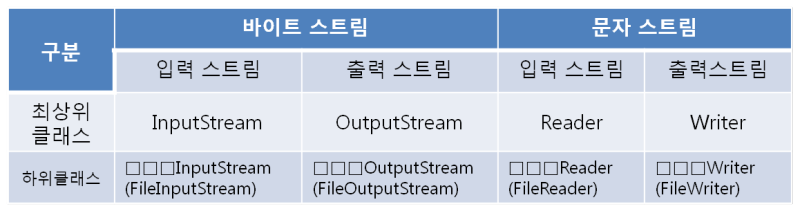
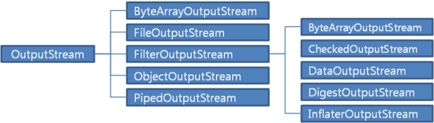
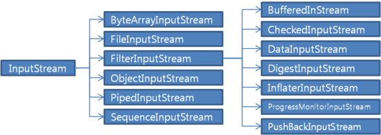
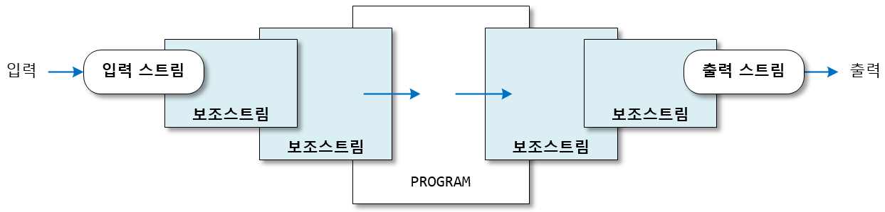

# 입출력
- I/O(입출력)란 컴퓨터 내부 또는 외부의 장치와 프로그램간에 데이터를 주고받는 것을 말한다.
- 자바에서 입출력을 수행하려면, 두 대상을 연결하고 데이터를 전송할 수 있는 연결통로인 스트림이 필요하다.

## 스트림
- 스트림은 단방향 통신만 가능하기 때문에 하나의 스트림으로 입력과 출력을 동시에 처리할 수 없다.
  - 입력과 출력을 동시에 수행하려면 입력을 위한 입력스트림과 출력을 위한 출력스트림, 총 2개의 스트림이 필요하다.
- 스트림은 먼저 보낸 데이터를 먼저 받게 되어 있으며, 중간에 건너뜀 없이 연속적으로 데이터를 주고 받는다.
- 자바에서는 java.io 패키지를 통해 많은 종류의 입출력 관련 클래스들을 제공함으로써, 입출력을 처리할 수 있는 표준화된 방법을 제공한다.

 

### 스트림의 종류
- 바이트기반 스트림: 그림, 멀티미디어 등의 바이너리 데이터를 읽고 출력할 때 사용
- 문자기반 스트림: 문자 데이터를 읽고 출력할 때 사용

 

### OutputStream
- 바이트 기반 출력 스트림의 최상위 클래스로 추상 클래스이다.
- 모든 바이트 기반 출력 스트림 클래스는 OutputStream 클래스를 상속받아서 만들어진다.

- OutputStream 클래스에는 모든 바이트 기반 출력 스트림이 기본적으로 가져야 할 메소드가 정의되어 있으며, 리턴타입은 모두 void
- 참고로, 출력 스트림은 출력할 바이트를 바로 보내는 것이 아니라 내부 버퍼에 우선 저장해 놓는다.

| 메소드                               | 설명                                         |
|-----------------------------------|--------------------------------------------|
| write(int b)                      | 1byte를 출력한다.                               |
| write(byte[] b)                   | 매개변수로 주어진 배열 b의 모든 바이트를 출력한다.              |
| write(byte[] b, int off, int len) | 매개변수로 주어진 배열 b[off] 부터 len개 까지의 바이틀르 출력한다. |
| flush()                           | 출력 버퍼에 잔류하는 모든 바이트를 출력한다.                  |
| close()                           | 출력 스트림을 닫는다.                               |

 

### InputStream
- 바이트 기반 입력 스트림의 최상위 클래스로 추상 클래스이다.
- 모든 바이트 기반 입력 스트림은 InputStream 클래스를 상속받아서 만들어진다.

- InputStream 클래스에는 바이트 기반 입력 스트림이 기본적으로 가져야 할 메소드가 정의되어 있다.

| 리턴타입 | 메소드                              | 설명                                                                  |
|------|----------------------------------|---------------------------------------------------------------------|
| int  | read()                           | 1byte를 읽고 읽은 바이트를 리턴한다.                                             |
| int  | read(byte[] b)                   | 읽은 바이트를 매개변수로 주어진 배열에 저장하고 읽은 바이트 수를 리턴한다.                          |
| int  | read(byte[] b, int off, int len) | len개의 바이트를 읽고 매개변수로 주어진 배열에서 b[off]부터 len개까지 저장한 후, 읽은 바이트 수를 리턴한다. |
| void | close()                          | 입력 스트림을 닫는다.                                                        |

 

### Writer, Reader
- java에서는 한 문자를 의미하는 char 형이 2byte이기 때문에, 문자기반의 스트림을 제공한다.
- 문자기반 스트림의 이름은 바이트기반 스트림의 이름에서 InputStream은 Reader로, OutputStream은 Writer로 바꾸기만 하면 된다.
- 문자기반 보조스트림 또한 존재하며, 사용목적과 방식은 바이트기반 보조스트림과 동일하다.

 

---
# 보조 스트림
- 다른 스트림과 연결되어 여러가지 편리한 기능을 제공해주는 스트림
  - 문자 변환, 입출력 성능 향상, 기본 타입 입출력등의 기능을 제공한다.
- 보조 스트림은 자체적으로 입출력을 수행할 수 없기 때문에, 입출력 소스와 바로 연결되는 InputStream, OutputStream, Reader, Writer 등에 연결해서 입출력을 수행한다.

- 보조 스트림을 연결하려면 보조 스트림을 생성할 때 자신이 연결될 스트림을 생성자의 매개값으로 제공하면 된다.
- 보조 스트림의 생성자 매개값은 보조 스트림이 될 수도 있으며, 이는 보조 스트림을 연속적으로 연결할 수 있다는 의미

 

## 문자 변환 보조 스트림
- OutputStreamWriter: 바이트 기반 출력 스트림에 연결되어 문자 출력 스트림인 Writer로 변환하는 보조 스트림
- InputStreamReader: 바이트 기반 입력 스트림에 연결되어 문자 입력 스트림인 Reader로 변환하는 보조 스트림

 

## 성능 향상 보조 스트림
- 입출력 속도가 빠른 프로그램과 느린 입출력 소스 사이에 메모리 버퍼를 두면, 실행 성능을 향상시킬 수 있다.
- 예를들어, 버퍼는 데이터가 쌓이기를 기다렸다가 꽉 차게 되면 데이터를 한꺼번에 하드 디스크로 보내면 출력 횟수를 줄일 수 있다.
- 기본적으로 출력 스트림은 내부에 작은 버퍼를 가지고 있지만 불충분하기 때문에, 메모리 버퍼를 추가로 제공하여 프로그램 실행 성능을 향상시키는 보조스트림을 제공한다.
- 바이트 기반 스트림에는 BufferedInputStream/BufferedOutputStream이 있고, 문자 기반 스트림에는 BufferedReader/BufferedWriter가 있다.

#### BufferedOutputStream, BufferedWriter
- 프로그램에서 전송한 데이터를 내부 버퍼에 쌓아 두었다가 버퍼가 꽉 차면, 퍼버의 모든 데이터를 한꺼번에 보낸다.
- 프로그램 입장에서 보면 메모리 버퍼로 데이터를 고속 전송하기 때문에 출력 성능이 향상되는 효과를 얻을 수 있다.
- BufferedOutputStream과 BufferedWriter는 생성자의 매개값으로 준 출력 스트림과 연결되어 추가적인 내부 버퍼를 제공한다.

#### BufferedInputStream, BufferedReader
- 입력 소스로부터 자신의 내부 버퍼 크기만큼 데이터를 미리 읽고 버퍼에 저장해 놓는다.
- 프로그램은 외부의 입력 소스로부터 직접 읽는 대신 버퍼로부터 읽어옴으로써 읽기 성능이 향상된다.
- BufferedInputStream과 BufferedReader는 생성자의 매개값으로 준 입력 스트림과 연결되어 추가적인 내부 버퍼를 제공한다.
- 참고로 BufferedReader는 라인 단위로 문자열을 읽는 매우 편리한 readLine() 메소드를 제공한다.
  - readLine()은 캐리지리턴(\r) + 라인피드(\n) 이전의 모든 문자열을 읽고 리턴한다.

 

## 기본 타입 입출력 보조 스트림
- DataInputStream과 DataOutputStream을 연결하면, 기본 타입을 입출력할 수 있다.
- 주의할 점은 데이터 타입의 크기가 모두 다르기 때문에 DataOutputStream으로 출력한 데이터를 다시 DataInputStream으로 읽어올 때는 출력한 순서와 동일한 순서로 읽어야 한다.

 

## 프린터 보조 스트림
- PrintStraem과 PrintWirter는 프린터와 유사하게 출력하는 print(), println() 메서드를 가지고 있는 보조 스트림이다.
- 콘솔 출력 스트림인 System.out이 바로 PrintStream 타입이기 때문에 print(), println() 메서드를 사용할 수 있었던 것
- println() 메소드는 출력할 데이터 끝에 개행 문자인 '\n'을 추가하기 때문에 콘솔이나 파일에서 줄 바꿈이 일어난다.
- print() 메소드는 '\n'을 추가하지 않기 때문에 개행 없이 문자를 출력한다.

> ### PrintStream과 BufferedReader
> PringStream의 println() 메서드로 출력한 내용은 개행 문자를 포함해서 출력하고, BufferedReadere의 readLine()은 개행 문자 앞까지 읽어오기 때문에 두 개를 함께 사용하면 편리하다.

 

## 객체 입출력 보조 스트림
- ObjectOutputStream과 ObjectInputStream을 연결하면 메모리에 생성된 객체를 파일 또는 네트워크로 출력할 수 있다.
- ObjectOutputStream은 객체를 직렬화하고, ObjectInputStream는 객체로 역직렬화한다.
- 직렬화란 객체를 바이트 배열로 만드는 것을 말하고, 역직렬화란 바이트 배열을 다시 객체로 복원하는 것을 말한다.

 

---
# 직렬화
- 자바에서는 java.io.Serializable 인터페이스를 구현한 객체만 직렬화할 수 있는데, Serializable는 아무런 내용도 없는 빈 인터페이스이다.
- 객체를 파일로 저장하거나 네트워크로 전송할 목적이라면, 클래스에 implements Serializable을 선언해서 JVM에게 직렬화해도 좋음을 알려주어야 한다.
- 만약 직렬화하고자 하는 객체의 클래스에 직렬화가 안되는 객체에 대한 참조를 포함하고 있다면, 제어자 transient를 붙여서 직렬화 대상에서 제외시킬 수 있다.
- 또는, 보안상 직렬화되면 안되는 값에 대해서도 transient를 사용할 수 있으며, traisent가 붙은 인스턴스 변수 값은 그 타입의 기본값으로 직렬화된다.

 

## 주의점
- 객체를 역직렬화할 때는 직렬화할 때의 순서와 일치해야 하므로, 직렬화할 객체가 많을 때는 각 객체를 개별적으로 직렬화하는 것보다는 ArrayList와 같은 컬렉션에 저장해서 직렬화하는 것이 좋다.
- 직렬화된 객체를 역직렬화할 때는 직렬화할 때와 같은 클래스를 사용해야 하며, 클래스 이름이 같더라도 내용이 변경된 경우에는 예외가 발생한다.
